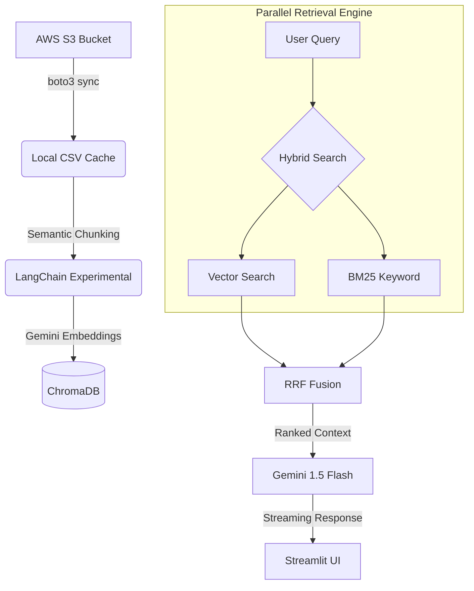

# 🩺 CareQuery: Next-Gen AI Healthcare Assistant

[](https://huggingface.co/spaces/Anuj020/CareQuery)
[](https://www.python.org/downloads/)
[](https://ai.google.dev/)
[](https://www.langchain.com/)

**CareQuery** is a high-performance, enterprise-grade Retrieval-Augmented Generation (RAG) pipeline designed for healthcare data. It leverages **Google Gemini**, **Hybrid Search**, and **Parallel Execution** to deliver instant, accurate, and context-aware medical insights.

---

## ✨ Features that Define CareQuery

### 🚀 Ultra-Low Latency Engine
- **Parallel Retrieval**: Executes Vector and Keyword searches simultaneously, cutting retrieval time by ~50%.
- **Smart Caching**: Persistent BM25 indexing and Streamlit resource caching ensure the app hits the ground running.
- **Real-time Streaming**: LLM responses stream word-by-word for a seamless, "live" interactive experience.

### 🧠 Advanced Medical Intelligence
- **Semantic Chunking**: Instead of rigid character limits, we split text based on shifts in meaning, preserving the clinical context of your data.
- **Hybrid Fusion (RRF)**: Combines the semantic power of **Gemini Embeddings** with the keyword precision of **BM25**, fused via Reciprocal Rank Fusion.
- **Deterministic Storage**: Every document has a unique fingerprint (MD5), ensuring your knowledge base remains clean and free of duplicates.

### 🛠️ Cloud-Native Ingestion
- **AWS S3 Integration**: Automatically syncs structured data (`.csv`) from industrial storage.
- **On-Demand Refresh**: Trigger full pipeline updates (Download → Chunk → Embed → Index) via a single click in the UI.

---

## 🏗️ Technical Architecture



---

## 🔧 Installation & Deployment

### 1. Environment Setup
```bash
# Clone and enter
git clone https://github.com/anujpatel-ai/CareQuery.git
cd CareQuery

# Setup environment
python -m venv .venv
source .venv/bin/activate  # Windows: .venv\Scripts\activate

# Install core stack
pip install -r requirements.txt
pip install rank_bm25 langchain_experimental boto3
```

### 2. Configuration
Create a `.env` file in the root:
```env
GOOGLE_API_KEY = "your_key"
AWS_ACCESS_KEY_ID = "your_key"
AWS_SECRET_ACCESS_KEY = "your_secret"
AWS_REGION = "us-east-1"
S3_BUCKET_NAME = "carequery"
```

---

## 💻 How to Use

1.  **Launch**: `streamlit run src/app.py`
2.  **Initialize**: Open the sidebar and click **"🔄 Refresh Knowledge Base"** to sync with S3.
3.  **Explore**: Ask questions like *"What are the complications of Type 2 Diabetes?"* and watch the system retrieve multi-source evidence in real-time.

---

## 🤝 Contributing
Contributions are welcome! If you're an AI engineer or medical professional, feel free to fork and submit a PR.

## 👨‍💻 Author
**Anuj Patel**  
*Applied AI Engineer | Building Scalable RAG Systems*  
🔗 [LinkedIn](https://www.linkedin.com/in/anuj020/) | 🧠 [Hugging Face](https://huggingface.co/Anuj020)

## 🤝 Contributors
- **Nirav Patel** (AI/LLM Engineer) 
🔗 [LinkedIn](https://www.linkedin.com/in/nirav-patel-39a26a151/)

  - Implemented High-Performance Parallel Search
  - Integrated Semantic Chunking & Vertex Search optimizations
  - Enhanced UI with Streaming & Caching
